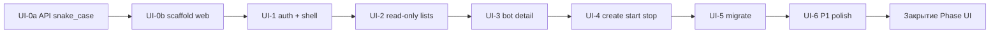

# План реализации Frontend (Phase UI)

**Версия:** 1.0  
**Основание:** [frontend.md](./frontend.md) (ТЗ UI v1.0), [TZ.md](./TZ.md) §11  
**Чеклист-статусы:** [IMPLEMENTATION_PLAN.md](./IMPLEMENTATION_PLAN.md) → Phase UI  
**Каталог кода:** `web/` (+ при необходимости `internal/api` / `internal/store` для JSON-контракта)

---

## 1. Как работать с субагентами

Цепочка та же, что для backend-фаз:

```
вы  --/manager-->  manager  -->  developer  -->  tester
                      ^                            |
                      |---- доработка (макс. 2) ---|
                      v
              отчёт вам + «Как проверить»
                      |
              ваше «ок» → manager отмечает «Принято вами»
```

| Роль | Что делает на Phase UI | Что не делает |
|---|---|---|
| **вы** | Выдаёте **один** блок (`UI-0` … `UI-6` или подпункт); принимаете блок явно | Не просите «весь frontend» |
| **manager** | Режет scope, пишет handoff, зовёт developer/tester, отмечает план в `docs/`, отчёт вам | Не пишет код в `web/` / Go |
| **developer** | Реализует только handoff; отчёт с командами проверки | Не берёт следующий блок сам; не коммитит без запроса |
| **tester** | Гоняет критерии handoff (build/test/команды); PASS / REWORK / FAIL_ESCALATE | Не пишет фичи; не закрывает «Принято вами» |

### 1.1. Правила выдачи заданий

1. Один вызов `/manager` = **один блок** из §3 (или явно названный подпункт внутри блока, если блок большой).  
2. Следующий блок — только после **Принято вами** на текущем (или после явного «можно UI-N+1», если вы так скажете).  
3. Backend-зависимость **UI-0a** (snake_case JSON) — отдельный handoff **до** или **вместе** с UI-0b; не смешивать с Create/Migrate.  
4. P2 из roadmap ([frontend.md](./frontend.md) §11) в этот план **не входят**, пока вы отдельно не попросите.

### 1.2. Шаблон handoff (manager → developer)

Manager обязан заполнять так (дополняет общий шаблон из `.cursor/agents/manager.md`):

```markdown
## Handoff для developer
**ID:** UI-N / краткое имя
**Цель:** …
**Сделать:**
- [ ] …  (пункты из FRONTEND_PLAN / IMPLEMENTATION_PLAN Phase UI)
**Не делать:** …
**Файлы/пакеты (ориентир):** web/src/… ; при API — internal/api/…
**Стек / conventions:** Vite+React+TS; UI на русском; комментарии в коде на русском;
  только control-api; типы snake_case ([frontend.md](./frontend.md) §4–5)
**Критерии для tester:**
- [ ] …
**Ручная проверка (для отчёта пользователю):** …
**Ссылки:** docs/frontend.md §…, docs/FRONTEND_PLAN.md §…, docs/IMPLEMENTATION_PLAN.md Phase UI
```

### 1.3. Что проверяет tester на UI-блоках

Минимум на каждый блок (плюс критерии блока):

| Проверка | Команда / действие |
|---|---|
| Сборка | `cd web && npm run build` (exit 0) |
| Dev поднимается | `npm run dev` стартует без ошибки (если блок уже имеет UI) |
| Scope | нет файлов/фич вне handoff |
| Контракт | запросы только к `control-api` путям из ТЗ; нет прямого Postgres |
| Секреты | token не светится в console.log / UI list как полный plaintext (masked ok) |

Для блоков с Go (UI-0a): дополнительно `go test` / `go build` по затронутым пакетам.

### 1.4. Отметки в плане

После **PASS** tester manager:

1. Ставит `[x]` на пунктах блока в этом файле и в `IMPLEMENTATION_PLAN.md` Phase UI.  
2. Статус Phase UI: `🚧 в работе` → по завершении блока `👀 ждёт вашей проверки`.  
3. **Принято вами** на блоке и финальный `✅ принята` на Phase UI — только после вашего явного ок.

---

## 2. Зависимости и порядок



| Блок | Зависит от | Можно параллелить |
|---|---|---|
| UI-0a | — | с подготовкой env control-api |
| UI-0b | желательно UI-0a (иначе normalize в client) | — |
| UI-1 | UI-0b | — |
| UI-2 | UI-1 | — |
| UI-3 | UI-2 | — |
| UI-4 | UI-3 | — |
| UI-5 | UI-4 | — |
| UI-6 | UI-5 (или после полного P0) | подпункты внутри по одному |

**Предусловие окружения (на вашей машине, не задача агентов):** подняты store + `control-api` (+ agent для actual_state в ручных сценариях). См. корневой README.

---

## 3. Блоки реализации

### UI-0a — JSON-контракт API (snake_case)

**Зачем:** ответы list/create сейчас PascalCase (нет json-тегов у store); запросы уже snake_case. UI должен жить на едином контракте ([frontend.md](./frontend.md) §5.5).

**Кто:** developer (Go: `internal/store` и/или DTO в `internal/api`).

**Сделать**

- [x] Ответы `GET/POST/PATCH` сущностей Node/Bot/Runtime/BotEvent в **snake_case** (имена из frontend.md §5.5)
- [x] Не сломать memory persist / postgres (теги или отдельный API DTO — выбрать меньший риск)
- [x] Тесты или ручная проверка curl: поле `bot_type` / `last_seen_at` в JSON
- [x] Краткая пометка в `docs/frontend.md` §5.5: «выровнено» / дата (manager после PASS)

**Не делать:** UI-экраны; смена семантики полей; RBAC.

**Файлы (ориентир):** `internal/store/types.go` и/или `internal/api/*.go`; тесты api/store.

**Критерии tester**

- [x] `go test` затронутых пакетов PASS  
- [x] `curl` list bots/nodes показывает snake_case ключи  
- [x] create/patch по-прежнему принимают snake_case  

**Ручная проверка**

```bash
# control-api запущен, есть токен
curl -s -H "Authorization: Bearer $CONTROL_API_TOKEN" http://127.0.0.1:8080/v1/bots | head
# ожидание: "bot_type", "desired_state", не "BotType"
```

**Решение:** API DTO в `internal/api` (store-типы без json-тегов; memory persist без изменений).

**Принято вами:** [x] (2026-07-19)

---

### UI-0b — Scaffold `web/`

**Зачем:** собираемый Vite+React+TS каркас, proxy, README.

**Сделать**

- [x] `web/`: Vite + React + TypeScript  
- [x] `npm run dev` / `build` / `preview` работают  
- [x] Dev-proxy: `/v1`, `/healthz` → `127.0.0.1:8080` (или `VITE_*`)  
- [x] Базовая структура каталогов из [frontend.md](./frontend.md) §10 (можно заглушки страниц)  
- [x] `web/README.md`: install, dev, build, нужен `CONTROL_API_TOKEN`  
- [x] Заготовка `api/types.ts` + `api/client.ts` (fetch, base URL, Bearer) под snake_case  
- [x] Заглушка роутера: `/login` и `/` (можно пустые)

**Не делать:** полноценный login UX; таблицы ботов; Go (если 0a уже закрыт).

**Критерии tester**

- [x] `cd web && npm ci` (или `npm i`) + `npm run build` → 0  
- [x] В `vite.config` есть proxy на control-api  
- [x] README содержит команды запуска  

**Ручная проверка**

```bash
cd web && npm install && npm run dev
# открыть URL Vite; страница грузится без ошибок в console
```

**Принято вами:** [x] (2026-07-19)

---

### UI-1 — Auth + App shell + healthz

**Зачем:** вход по токену, оболочка навигации, индикатор связи с API.

**Сделать**

- [x] `/login`: Base URL + Bearer token; проверка healthz + пробный `/v1/nodes` или `/v1/bots`  
- [x] Session в localStorage; «Выйти» чистит сессию  
- [x] `401` → возврат на login / понятное сообщение  
- [x] AppShell: нав Обзор / Боты / Ноды / Runtimes (Runtimes может вести на заглушку до UI-6)  
- [x] Индикатор API (poll `/healthz` или по запросам): online / offline  
- [x] Защита маршрутов: без сессии только `/login`  
- [x] UI-строки на русском  

**Не делать:** списки данных (кроме пробного запроса на login); create/start.

**Критерии tester**

- [x] build PASS  
- [x] без токена защищённые route редиректят на login  
- [x] неверный токен → ошибка, не «тихий» пустой layout  
- [x] верный токен → попадание в shell  

**Ручная проверка**

1. `npm run dev`, открыть UI.  
2. Неверный токен → ошибка.  
3. Верный `CONTROL_API_TOKEN` + URL → shell с нав.  
4. Выйти → снова login.  
5. Остановить control-api → индикатор/баннер показывают проблему.

**Принято вами:** [x] (2026-07-19)

---

### UI-2 — Read-only: Обзор, боты, ноды

**Зачем:** видеть состояние кластера без мутаций.

**Сделать**

- [x] `/nodes` — таблица: id, hostname, status, last_seen_at, agent_version; StatusPill  
- [x] `/bots` — таблица полей из ТЗ; client-side фильтры; query в URL желательно  
- [x] Подсветка desired ≠ actual  
- [x] Клик по боту → `/bots/:id` (страница-заглушка ок, если UI-3 следующим; лучше сразу route)  
- [x] `/` Обзор: сводки nodes/bots/runtimes + блок «Требуют внимания»  
- [x] Кнопка «Обновить» на списках  
- [x] Empty / Error / Loading состояния  
- [x] Опционально: минимальный `/runtimes` read-only (иначе строго в UI-6)

**Не делать:** create/start/stop/migrate; edit; toasts/poll (P1).

**Критерии tester**

- [x] build PASS  
- [x] при работающем API списки не пустые на сидах (если сиды есть)  
- [x] фильтры ботов меняют видимые строки  
- [x] нет POST/PATCH/migrate вызовов в коде страниц этого блока  

**Ручная проверка**

1. Войти → Обзор: counts согласованы с `ctl bots list` / API.  
2. Боты: фильтр по type/state.  
3. Ноды: виден status и относительное время last_seen.  
4. «Требуют внимания» кликабельно.

**Принято вами:** [x] (2026-07-19)

---

### UI-3 — Карточка бота + события

**Зачем:** паспорт бота и аудит.

**Сделать**

- [x] `/bots/:id` — все ключевые поля; desired/actual крупно; last_error плашкой  
- [x] `token_ref` только masked (как отдал API)  
- [x] Лента `GET /v1/bots/{id}/events`  
- [x] 404/нет в list → понятное «не найден»  
- [x] Ссылка назад к списку; ссылки на node/runtime если есть id  

**Не делать:** кнопки Start/Stop/Migrate (UI-4/5); PATCH form.

**Критерии tester**

- [x] build PASS  
- [x] карточка рендерит поля из API  
- [x] events-запрос вызывается; пустой список — empty state  

**Ручная проверка**

1. Открыть существующего бота из списка.  
2. Сверить поля с `curl /v1/bots`.  
3. Events: пусто или записи без падения UI.

**Принято вами:** [x] (2026-07-19)

---

### UI-4 — Create + Start / Stop

**Зачем:** повседневное управление жизненным циклом.

**Сделать**

- [ ] `/bots/new` — форма групп полей ([frontend.md](./frontend.md) §7.6); custom-поля условно  
- [ ] Клиентская валидация (name, port, custom_name, start_command, token_ref)  
- [ ] `POST /v1/bots` → редирект на карточку  
- [ ] Start / Stop на карточке (и опционально row actions)  
- [ ] Stop → ConfirmDialog  
- [ ] После команды: loading на кнопке; сообщение что actual догонит desired; refresh бота + events  
- [ ] Показ `error` из API (400/409 лимит)  

**Не делать:** migrate; PATCH edit; авто-poll.

**Критерии tester**

- [ ] build PASS  
- [ ] форма не шлёт custom_name для default  
- [ ] stop без confirm недоступен (есть dialog)  
- [ ] start/stop бьют правильные POST пути  

**Ручная проверка**

1. Создать default-бота `desired=stopped`.  
2. Start → desired=running; при живом agent дождаться actual (или failed+error).  
3. Stop → confirm → desired=stopped.  
4. Создать с занятым port → ошибка API читаема.

**Принято вами:** [ ]

---

### UI-5 — Migrate

**Зачем:** перенос бота между нодами через UI.

**Сделать**

- [ ] Действие «Migrate…» на карточке  
- [ ] Dialog: select нод из `GET /v1/nodes` (online выше; текущая исключена/disabled)  
- [ ] Confirm + `POST /v1/bots/{id}/migrate` с `{ "to_node_id" }`  
- [ ] Обновление карточки после успеха; показ ошибок  

**Не делать:** drain-node; handoff; авто-выбор ноды «умным» балансировщиком.

**Критерии tester**

- [ ] build PASS  
- [ ] без `to_node_id` submit не уходит / API 400 обработан  
- [ ] путь migrate вызывается только из confirm  

**Ручная проверка**

1. При ≥2 нодах: migrate → статус/desired/actual/migrating или ошибка с текстом.  
2. При 1 ноде: UI честно показывает, что переносить некуда (или только текущая disabled).

**Принято вами:** [ ]

---

### UI-6 — P1: runtimes, edit, poll, toasts

**Зачем:** паритет с типичным `ctl` и удобство оператора.

**Сделать** (можно дробить на UI-6.1 / 6.2 по запросу пользователя)

- [ ] `/runtimes` — таблица + lease warning; связь фильтром ботов  
- [ ] `/nodes/:id` — боты и runtimes на ноде  
- [ ] `/bots/:id/edit` — PATCH (token_ref, assignment, scenario_config)  
- [ ] Toasts на успех/ошибку команд  
- [ ] Авто-poll 3–10s на списках/карточке + «обновлено N с назад»  
- [ ] Фильтр событий по типу (если просто)  
- [ ] Обновить `web/README.md` и при необходимости корневой README  

**Не делать:** dark theme; e2e playwright suite; embed в control-api; handoff wizard.

**Критерии tester**

- [ ] build PASS  
- [ ] PATCH путь корректен; пустой token_ref не затирает секрет  
- [ ] poll не устраивает полный unmount-мигание (визуально/кодом разумно)  

**Ручная проверка**

1. Runtimes видны, клик ведёт к ботам с фильтром.  
2. Edit token_ref → masked в ответе; бот обновлён.  
3. Оставить список ботов открытым ~15s — данные обновляются без F5.

**Принято вами:** [ ]

---

### Закрытие Phase UI

**Сделать (manager + ваша приёмка)**

- [ ] Все блоки UI-0a … UI-5 с **Принято вами**; UI-6 — если входил в договорённый scope P0+P1  
- [ ] Критерии [frontend.md](./frontend.md) §13.1 закрыты  
- [ ] Пройден ручной сценарий §13.2  
- [ ] Сводка в IMPLEMENTATION_PLAN: Phase UI → `✅ принята`  

**Принято вами (вся Phase UI):** [ ]

---

## 4. Матрица ответственности по артефактам

| Артефакт | manager | developer | tester | вы |
|---|---|---|---|---|
| Handoff | пишет | читает | читает критерии | формулирует блок |
| Код `web/` | — | пишет | проверяет | смотрит UI |
| Код Go (UI-0a) | — | пишет | проверяет | curl/ок |
| `docs/FRONTEND_PLAN.md` отметки | `[x]` после PASS | — | — | «Принято вами» |
| `docs/IMPLEMENTATION_PLAN.md` | статусы фазы | — | — | ок на фазу |
| `docs/frontend.md` уточнения | по решениям | — | — | решения |
| Коммит | только если попросите | только если в handoff | — | обычно просите явно |

---

## 5. Примеры команд вам → manager

```text
/manager Phase UI, блок UI-0a (snake_case JSON в control-api)
```

```text
/manager UI-0b — scaffold web/ Vite React TS
```

```text
/manager UI-1 auth и app shell
```

```text
/manager UI-2 read-only обзор боты ноды
```

```text
/manager UI-4 create start stop
```

```text
/manager UI-0b принят — отметь Принято вами; дальше не начинай
```

```text
/manager UI-6.1 только страница runtimes (без edit и poll)
```

---

## 6. Definition of Done (блок готов к вашей проверке)

Блок считается готовым к статусу `👀 ждёт вашей проверки`, когда:

1. Tester вынес **PASS**.  
2. Manager отметил пункты `[x]` (кроме «Принято вами»).  
3. В отчёте manager есть пошаговое «Как проверить вручную».  
4. В отчёте явно «Что НЕ входило».  
5. Нет незакрытого REWORK / FAIL_ESCALATE по этому handoff.

---

## 7. Риски и как режем

| Риск | Митигация в плане |
|---|---|
| «Сделай весь UI» | Manager отказывает; предлагает один блок из §3 |
| PascalCase ломает UI | UI-0a первым; иначе normalize только в `api/client` как временный долг (зафиксировать в отчёте) |
| Нет второй ноды для migrate | UI-5: проверить dialog/disabled; полный e2e migrate — ваша среда |
| Actual не меняется без agent | В ручных шагах явно: нужен agent; UI показывает desired сразу |
| Раздувание P1 внутри P0 | UI-6 только после UI-5; дробить 6.1/6.2 |
| Tester гоняет браузер вручную | Для PASS достаточно build + статическая сверка кода/критериев; полный клик-путь — ваша приёмка |

---

## 8. Связь документов

| Документ | Роль |
|---|---|
| [frontend.md](./frontend.md) | **Что** строить (ТЗ) |
| **FRONTEND_PLAN.md** (этот файл) | **Как** резать на блоки и гонять агентов |
| [IMPLEMENTATION_PLAN.md](./IMPLEMENTATION_PLAN.md) | Сводка статусов Phase UI + короткие чеклисты |
| `.cursor/agents/*.md` | Роли manager / developer / tester |

---

## 9. История

| Версия | Дата | Изменение |
|---|---|---|
| 1.0 | 2026-07-19 | Первый подробный план Phase UI под manager/developer/tester |
