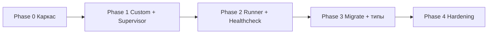

# План реализации MVP Bot Runtime Manager

**Версия:** 0.2  
**Основание:** [TZ.md](./TZ.md) v0.3  
**Цель документа:** пошаговый план для реализации и handoff субагентам. Пользователь **сам проверяет каждый этап**; целиком проект агентам не отдаётся.

---

## 0. Как пользоваться планом

1. Идём **строго по фазам**: следующая фаза не начинается, пока пользователь **вручную** не принял текущую.  
2. Пользователь выдаёт **manager** только одну задачу / один этап (или явный короткий набор T0x) — **не** весь проект сразу.  
3. Каждая задача ниже — кандидат на один handoff developer’у (один логический коммит / узкий diff).  
4. Источник истины по продукту — ТЗ; план уточняет **порядок и границы**, не заменяет ТЗ.  
5. Цепочка агентов: **пользователь → manager → developer → tester → manager → пользователь** (см. §0.1).

### 0.1. Рабочий процесс агентов

```
Пользователь
    │  задание на один этап / задачу
    ▼
 manager  ──планирует──►  developer  ──отчёт──►  tester
    ▲                                              │
    │         доработка (макс. 2 итерации)         │
    │◄─────────────────────────────────────────────┤
    │                                              │
    │◄──────── финальный отчёт tester ─────────────┘
    │
    ▼
 подробный отчёт пользователю + как проверить вручную
```

| Роль | Делает | Не делает |
|---|---|---|
| **manager** | дробит задание пользователя на handoff; зовёт developer/tester; итожит | не пишет прод-код; не стартует следующий этап без ок пользователя |
| **developer** | реализует **только** текущий handoff | не расширяет scope; не «закрывает весь план» |
| **tester** | проверяет результат developer; доработка или отчёт | не реализует фичи; максимум **2** цикла доработки, затем отчёт manager |

**Итерации tester → developer:** 1-й и 2-й возврат на доработку допустимы. После 2-й доработки и повторной проверки tester **обязан** отчитаться manager (pass / fail с остатком проблем) — без 3-го круга.

**Ручная приёмка:** после отчёта manager пользователь сам прогоняет «Как проверить». Только после явного ок пользователя можно брать следующий этап.

### Definition of Done (для любой задачи агентов)

- Код собирается (`go build ./...`), если задача затрагивает Go.  
- Tester прогнал проверки из handoff (авто и/или команды).  
- Есть блок **«Как проверить вручную»** в финальном отчёте manager.  
- Комментарии и ответы — по `.cursor/rules/main.mdc`.  
- Scope соседних фаз / соседних T0x не тянем «заодно».

---

## 1. Целевая картина MVP (что должно работать в конце Phase 2–3)

На **одной ноде**:

1. PostgreSQL с схемой `nodes` / `runtimes` / `bots` / `bot_events`.  
2. `agent` поднимает/гасит OS-процессы по БД.  
3. ≥2 бота `default` в **одном** `bot-runner`.  
4. ≥1 `custom` бот — отдельный процесс по launch contract.  
5. `ctl` меняет desired в БД → состояние сходится.  
6. `healthcheck` пишет unhealthy по `/healthz`; рестарт делает `agent`.  

Multi-node migrate и полноценный `control-api` — Phase 3 (можно урезать MVP до «заложено в схеме»).

---

## 2. Порядок фаз и зависимости



| Фаза | Результат | Блокирует |
|---|---|---|
| 0 | Модуль, БД, пустые cmd, docker-compose | всё |
| 1 | Custom start/stop через агент + ctl | runner бессмысленен без supervisor |
| 2 | Multi-tenant default + healthcheck | плотность ботов, приёмка MVP |
| 3 | Lease/migrate/вторая нода | масштабирование |
| 4 | NOTIFY, лимиты, handoff-утилита | production polish |

---

## 3. Phase 0 — Каркас репозитория

**Цель:** пустой, но собираемый скелет + живая PostgreSQL локально.

### 0.1. Инициализация Go-модуля

- [ ] `go mod init` (имя модуля согласовать, например `github.com/<org>/mvp-manager` или `mvp-manager`).  
- [ ] Каталоги: `cmd/agent`, `cmd/ctl`, `cmd/migrate`, `internal/config`, `internal/db`.  
- [ ] Заглушки `main.go` с `-h` / печатью версии.  
- [ ] `.gitignore`: `bin/`, `.env`, IDE.  
- [ ] Корневой `README.md` (кратко: что это, как поднять Postgres, как мигрировать).

**Приёмка:** `go build ./cmd/agent ./cmd/ctl ./cmd/migrate`.

### 0.2. Docker Compose + конфиг

- [ ] `docker-compose.yml`: PostgreSQL 16+, volume, порт `5432`, healthcheck контейнера.  
- [ ] `.env.example`: `DATABASE_URL`, `NODE_ID`.  
- [ ] `internal/config`: чтение из ENV (без YAML на первом шаге — проще).

**Приёмка:** `docker compose up -d` → Postgres ready; конфиг парсится в unit-тесте или `ctl` dry-run.

### 0.3. Миграции схемы

- [ ] Выбрать инструмент: **goose** (SQL-миграции).  
- [ ] `cmd/migrate` — обёртка `goose up/down/status`.  
- [ ] SQL по ТЗ §6: enums, `nodes`, `runtimes`, `bots`, `bot_events`, индексы, UNIQUE(`port`), CHECK для `custom_name`.  
- [ ] Пока **без** LISTEN/NOTIFY-триггеров (Phase 4).

**Приёмка:** `migrate up` на чистой БД идемпотентно проходит; `migrate down` (хотя бы одна ступень) не ломает повторный up.

### 0.4. Минимальный доступ к БД

- [ ] `pgxpool` в `internal/db`.  
- [ ] Ping при старте `agent`/`ctl`.  
- [ ] Заготовка repository-интерфейсов (пустые методы ок).

**Приёмка:** `agent` стартует, пишет лог «db ok», корректно завершается по SIGINT.

### Критерии закрытия Phase 0

- Схема соответствует ТЗ (поля port, bot_type, custom_name, assigned_node_id, lease-поля на runtimes).  
- Локальный контур: compose + migrate + build.

---

## 4. Phase 1 — Custom bots + Supervisor + ctl

**Цель:** один custom-бот (заглушка-бинарник) стартует/останавливается по `desired_state` в БД.

### 1.1. Доменные типы

- [ ] `internal/process` или `internal/runtime`: структуры Runtime, Bot (без тяжёлой логики).  
- [ ] Маппинг строк БД ↔ Go-типы.

### 1.2. Supervisor

- [ ] `Start(ctx, spec)` / `Stop(ctx, grace)` / учёт PID / `Wait` в горутине.  
- [ ] Process group (`Setpgid`), SIGTERM → wait → SIGKILL.  
- [ ] Подробные комментарии по жизненному циклу (правило main).

**Приёмка:** unit-тест с тестовым `sleep`/echo-процессом: start → PID жив → stop → процесса нет.

### 1.3. Reconcile только для `kind=custom_bot`

- [ ] Цикл: выбрать runtimes ноды → desired vs actual → start/stop.  
- [ ] Писать `pid`, `actual_state`, `last_error`, `exit_code`.  
- [ ] Heartbeat в `nodes`.  
- [ ] Пока **без** полноценного lease (поля есть, логика — заглушка или простой single-node).

**Приёмка:** вручную `UPDATE desired_state` → в течение ≤ reconcile_interval процесс появляется/исчезает.

### 1.4. `ctl` (без HTTP)

- [ ] Команды: `bots create`, `bots start`, `bots stop`, `bots list`, `runtimes list`.  
- [ ] Create custom: пишет `bots` + `runtimes`, проверяет UNIQUE port.  
- [ ] Токен в MVP: поле/ENV (без vault).

**Приёмка:** сценарий CLI создаёт custom → start → list показывает running → stop.

### 1.5. Fixture custom-бота

- [ ] Простейший бинарник-заглушка в `testdata/fake-bot` или `examples/fake-bot`:  
  - читает `PORT`, `BOT_MODE`;  
  - при webhook слушает `/healthz`;  
  - при polling просто живёт до SIGTERM.

**Приёмка:** end-to-end через `ctl` + fake-bot.

### Критерии закрытия Phase 1

- Custom управляется из БД/`ctl`.  
- Агент не падает при краше ребёнка: `actual_state=failed`.  
- `control-api` **не обязателен** (отложить).

---

## 5. Phase 2 — Multi-tenant `bot-runner` + `healthcheck`

**Цель:** закрыть ключевую приёмку плотности default-ботов.

### 2.1. Репозиторий / пакет `bot-runner`

Решение на старте фазы (зафиксировать в README):

- **A (предпочтительно для MVP):** monorepo `mvp-manager/cmd/bot-runner` + `internal/runner/...`  
- **B:** отдельный модуль `bot-runner/`  

### 2.2. Ядро runner

- [ ] Загрузка ботов: `bot_type IN ('default', ...)` AND `assigned_node_id` AND `desired_state=running` AND `runtime_id`.  
- [ ] In-memory registry инстансов.  
- [ ] Add / remove / reload по `config_version`.  
- [ ] Сценарий `default`: минимальный (echo/healthz + заглушка апдейтов), без полного Telegram до стабилизации lifecycle.  
- [ ] Webhook: `Listen` на `bot.port`.  
- [ ] Polling: горутина-заглушка без bind.

**Приёмка:** два default webhook-бота → **один** PID runner, два разных порта отвечают на `/healthz`.

### 2.3. Агент управляет runtime `bot_runner`

- [ ] Если есть default* desired=running — ensure один `runtimes.kind=bot_runner` на ноду.  
- [ ] Старт/стоп бинарника runner.  
- [ ] Привязка `bots.runtime_id`.

**Приёмка:** stop runner в БД → процесс убит; start → снова поднимает инстансы.

### 2.4. Реальная интеграция мессенджера (подфаза)

После стабильного lifecycle:

- [ ] Telegram adapter для `default` (polling и/или webhook) — через Context7 по актуальному SDK.  
- [ ] Max — второй канал, можно после Telegram.  
- [ ] Токены из `token_ref` / конфиг.

**Приёмка:** один тестовый Telegram-бот отвечает на `/start` (сценарий default).

### 2.5. `cmd/healthcheck`

- [ ] Отдельный бинарник, интервал 10–30s.  
- [ ] Только webhook + desired=running.  
- [ ] Пишет events / unhealthy; **не** рестартит.  
- [ ] Агент: при unhealthy/failed → restart instance или runtime по policy.

**Приёмка:** убить listener бота (или вернуть 500 из заглушки) → healthcheck отмечает unhealthy → агент восстанавливает.

### Критерии закрытия Phase 2

- Пункты 1–4, 6–8 из ТЗ §16 (MVP acceptance) закрыты для single-node.  
- Бинарники: `agent`, `bot-runner`, `healthcheck`, `ctl`.

---

## 6. Phase 3 — Типы, lease, migrate, API

### 3.1. Каталог типов

- [ ] `default_extended` как второй сценарий в runner.  
- [ ] Регистрация сценариев через узкий интерфейс (SOLID, без «божественного» switch навсегда).

### 3.2. Lease

- [ ] Acquire / renew / release на `runtimes`.  
- [ ] Не стартовать без lease.  
- [ ] Тест гонки двух агентов (два `NODE_ID` на одной БД) — второй не поднимает тот же runtime.

### 3.3. Migrate

- [ ] Протокол ТЗ: stop/remove → wait → reassign → start/add.  
- [ ] `ctl bots migrate` (+ позже API).  
- [ ] Default и custom пути раздельно.

**Приёмка:** E2E migrate на двух агентах (можно два процесса на одной машине с разными `NODE_ID`).

### 3.4. `control-api`

- [ ] Вынести HTTP из любых временных заглушек.  
- [ ] Эндпоинты ТЗ §11.  
- [ ] Auth: token. Bind localhost по умолчанию.

### 3.5. Шаблон handoff клиенту

- [ ] Документ + пример `.env.example` для single-bot.  
- [ ] `cmd/handoff` — опционально в конце фазы или Phase 4.

### Критерии закрытия Phase 3

- ТЗ §16 п.9–10.  
- Двухнодовый сценарий migrate зелёный.

---

## 7. Phase 4 — Hardening

- [ ] `LISTEN/NOTIFY` + poll safety net.  
- [ ] Restart policy / backoff.  
- [ ] Метрики (хотя бы slog-счётчики или Prometheus later).  
- [ ] Лимиты ботов на ноду.  
- [ ] Шардирование нескольких runner’ов.  
- [ ] Секреты токенов.  
- [ ] `doctor` / `drain-node` по необходимости.

---

## 8. Параллельные дорожки (не блокируют Phase 0–1)

| Дорожка | Когда | Заметки |
|---|---|---|
| Субагенты manager/developer | После утверждения плана | Короткие handoff по задачам §3–7 |
| CI (build + vet + test) | С Phase 0–1 | `go test ./...` |
| Документация оператора | Phase 1+ | Как поднять агент systemd unit — позже |
| Настоящие custom-репо клиентов | Phase 2+ | Нужен только launch contract |

---

## 9. Рекомендуемый бэклог первых 10 задач (для developer)

| ID | Фаза | Задача | Оценка сложности |
|---|---|---|---|
| T01 | 0 | go mod + структура cmd/internal + .gitignore | S |
| T02 | 0 | docker-compose Postgres + .env.example | S |
| T03 | 0 | goose миграции схемы ТЗ §6 | M |
| T04 | 0 | config + db pool + ping в agent | S |
| T05 | 1 | supervisor Start/Stop/Wait + тест | M |
| T06 | 1 | reconcile custom_bot + heartbeat | M |
| T07 | 1 | ctl create/start/stop/list | M |
| T08 | 1 | examples/fake-bot + E2E скрипт | S |
| T09 | 2 | bot-runner registry + 2× webhook ports | L |
| T10 | 2 | healthcheck + реакция агента на unhealthy | M |

Дальше — T11+ из Phase 2.4 (Telegram), Phase 3 (lease/migrate/api).

---

## 10. Риски на старте реализации

| Риск | Что делаем в плане |
|---|---|
| Сразу писать Telegram + менеджер | Сначала lifecycle (fake-bot), мессенджер — подфаза 2.4 |
| Сделать control-api раньше ctl | Сначала ctl (быстрее для отладки) |
| Multi-tenant без supervisor | Phase 1 строго до Phase 2 |
| Раздуть Phase 0 | Не тащить NOTIFY, lease-логику, API |

---

## 11. Чеклист утверждения плана

- [ ] Согласован module path / имя репо.  
- [ ] Согласован monorepo для `bot-runner` (A) или отдельный модуль (B).  
- [ ] MVP = конец Phase 2 (+ опционально заготовки Phase 3 в схеме).  
- [ ] Telegram/Max не блокируют закрытие lifecycle Phase 2.1–2.3.  
- [ ] Подтверждён режим: **поэтапная ручная приёмка**, без делегирования всего проекта.  
- [x] Субагенты: `.cursor/agents/manager.md`, `developer.md`, `tester.md`.

---

## 12. Следующий шаг

1. Пользователь выдаёт manager **одно** задание (например: «Phase 0 / T01–T04» или только T01).  
2. Manager → developer → tester (≤2 доработки) → отчёт manager пользователю.  
3. Пользователь проверяет по инструкции → ок → следующее задание.  
4. **Не** запускать Phase N+1, пока Phase N не принята вручную.

---

## 13. Антипаттерны процесса

- Отдать manager «сделай весь MVP / все фазы».  
- Developer сам переходит к следующей задаче плана без нового задания от manager.  
- Tester чинит код вместо возврата developer.  
- Больше двух кругов доработки без эскалации manager.  
- Manager объявляет этап закрытым без ручной проверки пользователя.